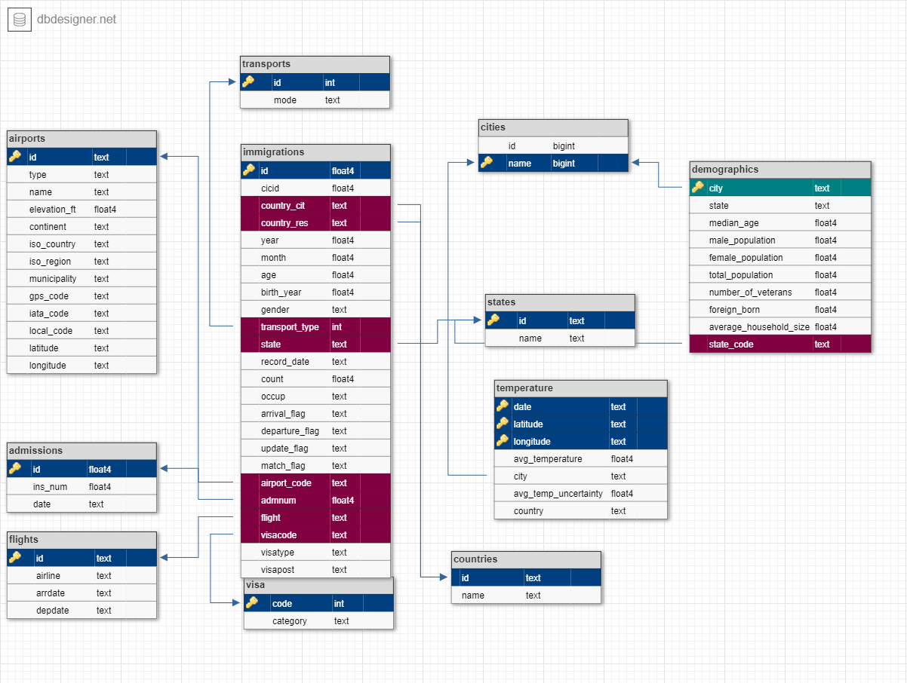

# Data Engineering Capstone Project

Data Engineering Nanodegree conclusion project.

## Immigration in the US

The following project consists in building a database model for immigration data in the United States of America. Analyses on this data can be useful for both government and business decision making.

#### Datasets

- I94 Immigration Data: This data comes from the US National Tourism and Trade Office, but for this notebook only a small sample will be used. [This is where the data comes from](https://travel.trade.gov/research/reports/i94/historical/2016.html).

- World Temperature Data: This dataset came from Kaggle. [You can read more about it here](https://www.kaggle.com/berkeleyearth/climate-change-earth-surface-temperature-data).

- U.S. City Demographic Data: This data comes from OpenSoft. [You can read more about it here](https://public.opendatasoft.com/explore/dataset/us-cities-demographics/export/).

- Airport Code Table: This is a simple table of airport codes and corresponding cities. [It comes from here](https://datahub.io/core/airport-codes#data).

# Data Model

## Schema

Event though they have some limitations, relational databases are consolidated and well suited for Big Data situations. For many of the upcoming analyses in this notebook there is no need to resort to Cloud solutions for Data Warehousing such as AWS Redshift, so I opted to stick to the basics and at the end of this document you can find some scenarios(where reasonable solutions are adressed) that require more speed and scalability. PostgreSQL is the RDBMS of choice as it integrates easily with Python.

The schema is described as follows:

## facts table

- immigrations

  * id, country_cit, country_res, cicid, year,
  * month, age, birth_year, gender, transport_type,
  * state, record_date, count, occup, arrival_flag,
  * departure_flag, update_flag, match_flag ,airport_code,
  * admnum,flight, visacode, visatype, visapost

## dimension tables

- admissions

  * id, ins_num, date

- flights

  * id, airline, arrdate, depdate

- airports
   * idtype, name, elevation_ft, continent, iso_country,
   * iso_region, municipality, gps_code, iata_code, local_code,
   * latitude, longitude

- countries

  * id, name

- states

  * id, name

- cities
  * id, name 

- demographics

    * city, state, median_age, male_population, female_population,
    * total_population, number_of_veterans, foreign_born,
    * average_household_size, state_code, race, count

- temperature

  * date, avg_temperature, avg_temp_uncertainty, city, country, latitude, longitude

- transports

  * id ,mode (1 = 'Air', 2 = 'Sea', 3 = 'Land', 9 = 'Not reported'-NA included)

- visa

  * code, category (1 = Business, 2 = Pleasure, 3 = Student)

### Schema design

#### ETL pipeline

Extracting files content, checking for inconsistencies across datasets, and finally inserting data into tables described by the Schema.

### Data Quality Checks

The data quality checks include:
 * Integrity constraints on the relational database;
 * Insert statements check for duplicates before inserting data into table;
 * If an exception occurs when inserting data, display log info;
 * Checking if tables records are correctly loaded.
 
 ### Data analysis

Some analysis on immigration data could be:

- Find patterns of gender and/or age(differences in visa type or airline chosen);
- Rank airlines and routes by number of immigrants transported;
- Track flow of passengers flying to great urban centers;
- Find patterns of immigration based on seasons of the year;
- Check if there is a relation between a city thermal amplitude and emigration.

## Complete Project Write Up

A data model was created to store relational data on immigration in the USA. PostgreSQL was the choice of use for its easy integration with Python. As mentioned earlier, using a relational database may be enough for most applications, but the cost of its limitations, such as having to draw a complex schema beforehand, can slow down the development process. Moving to the cloud is always an option and some situations where this is reasonable are described below.

Possible decisions for alternate scenarios:

- "Data increases by 100x": Instead of using a structured database in disk, a Data Lake could be used, as the project especifies that various types and sources of data(structured or unstructured) can be explored. It is not possible to tell upfront which will be useful. A possible approach is to launch an EMR Cluster and design the schema on read.

- "The data populates a dashboard that must be updated on a daily basis by 7am every day": Schedule tasks using Apache Airflow.

- "The database needed to be accessed by 100+ people": Redshift Clusters can handle the traffic without changing the RDBMS, but it's important to monitor AWS billing to avoid unnecessary costs.